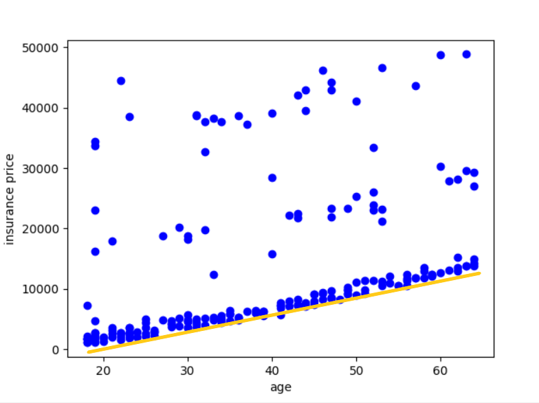
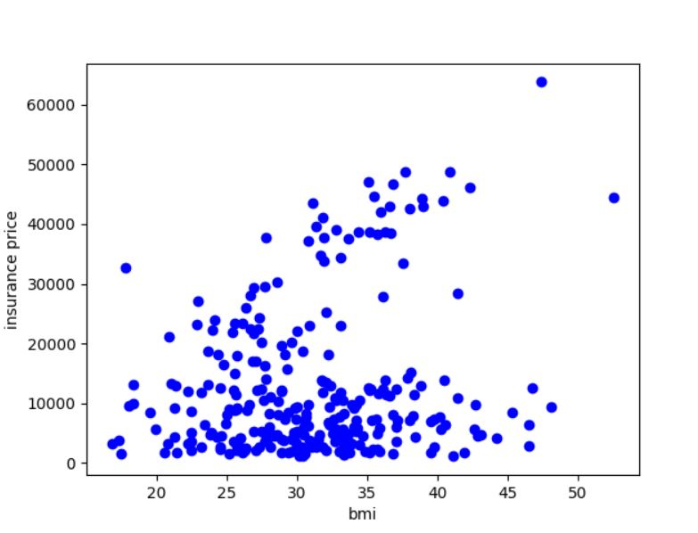
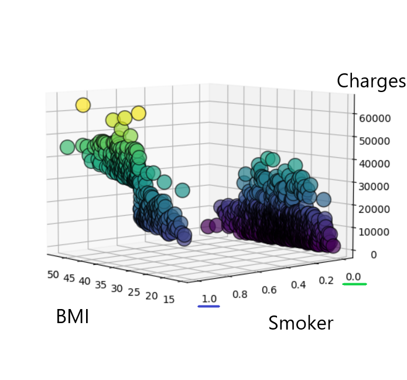
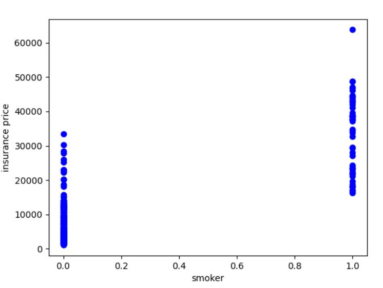
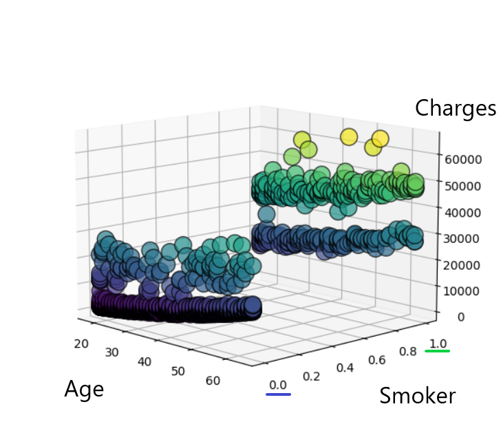
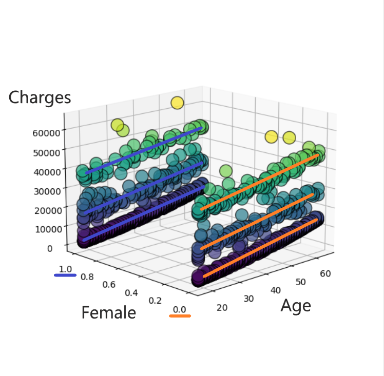
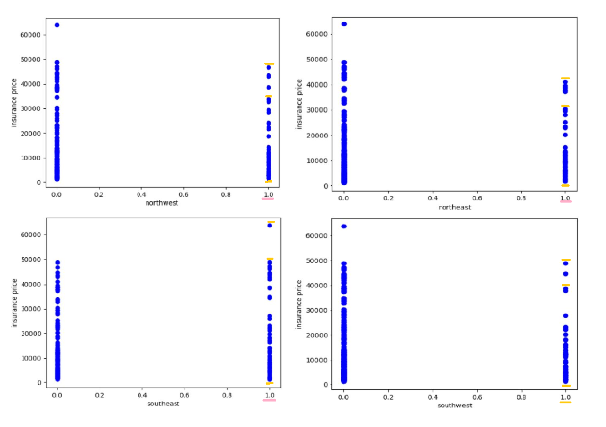

# Determining relevant features considered in a quotation for a life insurance
#### Serrano, L. Tecnológico de Monterrey. Computer System Engineering: Intelligent Systems Course.
## Introduction
As we are becoming mature, younger generations question the health implications and environmental impact of products and actions that in the past were considered the normal in western life. Common products just like: dairy products, plastic, cigarettes, coke and meat; and actions such as mineral and agricultural explotation.  So it is not surprise that with the time we want to become more aware and responsable of our future and what we can change about it.

Life insurance is a service that gives the opportunity to the inversor of guaranteeing their loved ones with economic support. It requires of an actualization of contract per year, and it represent a new expense to consideration. But again, it is quite different the cost depending on each profile.

If we are able to understand the relation between variables, and we are able to change some, the cost implications could be significantly reduce in our favour.
 
## Solution
The idea is to discover the relevance of the aspects that determine the final cost of the insurance and estimate a price for the user with the help of sklearn Lasso Regression and a Handmade Gradient Descent.
### Hypothesis
There is a direct correlation of the age and the lifestyle to the determination of the price for a life insurance.
## Data Set
### Requirements
After analyzing the questionning, the desired amount of data needed to prove the hypothesis required to include:
* Age of the applicant
* Sex
* Nocive substances consumption
* Profession risk
* Medical condition
* Terminal diseases
* BMI
* Personal quotation
### Definition
Searching for free data set in webpages and opensource repositories, the one that fulfilled more the requirements was the data set provided by Steadnick.
This included the following:

Feature  |  Description  | 
------------- | -- | 
Age  |  Age of the applicant.  | 
Sex  |  Sex of the applicant (Female \| Male).  |
BMI  |  Universal measure (kg/m^2 ).  |
Children  | Quantity of children the applicant has (not determined if children under guardianship).  |
Smoker  |  If the applicant consumes tobacco in a modern basis (Yes \| No).  |
Region  |  Division of the United States in four regions (Northeast \| Northwest \| Southeast \| Southwest).  |
Charges  |  Quotation offered to the applicant. |
## Method
### Regression
#### Lasso Framework
#### Handmade Gradiant Descent

## Results
### Initial Hypothesis
The first runs proved that in fact, the age was a determining factor for the charges of price. The regression show the maximum cost-benefit risk the company is willing to take depending of the age of the applicant.

What became surprising was that BMI by itself did not had an influence in the determination of the charges per applicant.

It was only after plotting with multiple variable the smoking factor and the BMI of the applicant that the regression could show the relevance of them, with greater importance on the smoking consumption.

Still smoking and the age were not conclusive.

What became appearing every time and more frequently was the pressence of these segmentation of data points: 

Which lead to the interpretation that there was at least one factor missing to the equation.
### Reappraisal and Discussion
With the considered approach the relevance of the Age and Smoker were displayed but it was insufficient to determine all the relevant factors for the pricing.
The segmentation could have impplied the relevance of the region, so it was added to the proposition.

At the end again, this addtion to the results were not conclusive to determine that the appearance of the three segmantations depend one the region, but for the finance.

By analysing the data from the data set and the information of the results, it was only needed to research a little more to conclude that the adquisition power was an important factor to the equation. As in different webpages found, the insurance carriers present different plans for the needs and limitations of the applicant.

## Limitations
The data set did not have all the data needed to found all the relations found in the insurance's quotation, but it gave important information to the discussion.

It is needed more information about de data set to determine if the conclusions from the discussion apply to them. As questions as: number of plans, name of the company, year of expedition were not found on the Internet.
## Conclusion
Even if the discussion proves by itself that there is evidence to considere the decision of the applicant and the plans offered by the insurance carriers, it was found that the lifestyle makes an important distinction on the final cost, as companies will prevent more from multifactors risk.
## References
Dwivedi, S. Irresponsible Agriculture & its Impact on Environment. https://krishijagran.com/blog/irresponsible-agriculture-its-impact-on-environment/

Steadnick, Z. Machine Learning with R. datasets. https://github.com/stedy/Machine-Learning-with-R-datasets

Tukker, A., Huppes, G., et. al. EIPRO: Analysis of the life cycle environmental impacts related to the final consumption of the EU-25. https://ec.europa.eu/environment/ipp/pdf/eipro_report.pdf

Zack. Introduction to Lasso Regression. https://www.statology.org/lasso-regression/

n.d. NewYorkLife. Six reasons why to buy Life Insurance. https://www.newyorklife.com/articles/six-reasons-to-buy-life-insurance#:~:text=Your%20life%20insurance%20gives%20your,%2C%20and%20much%2C%20much%20more.&text=Life%20insurance%20provides%20cash%20when%20it%27s%20needed%20most.

n.d. MLTut. Stochastic Gradient Descent- A Super Easy Complete Guide! https://www.mltut.com/stochastic-gradient-descent-a-super-easy-complete-guide/
